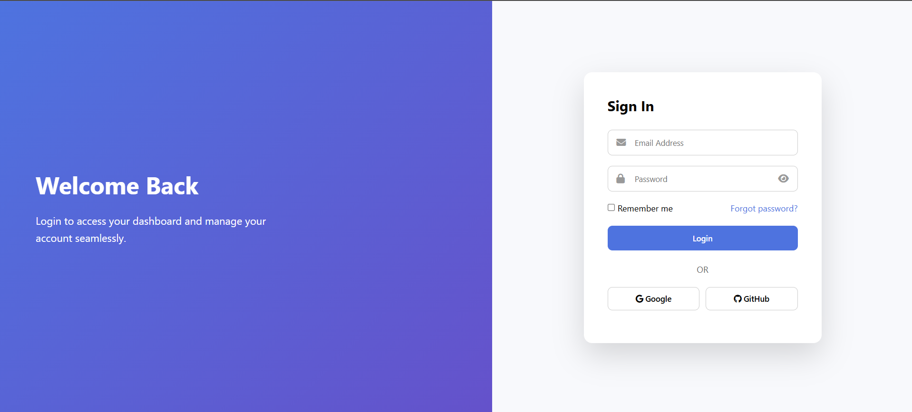
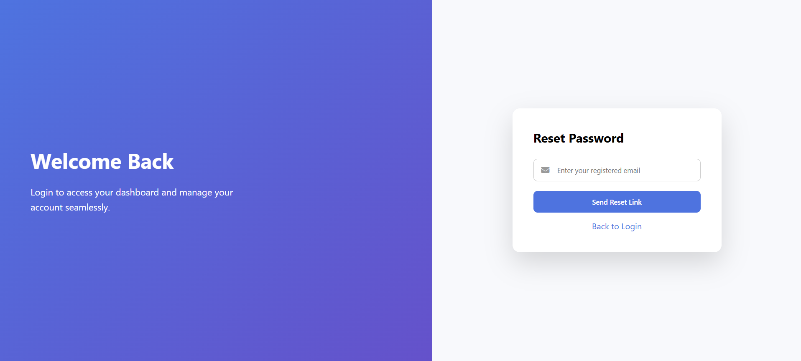
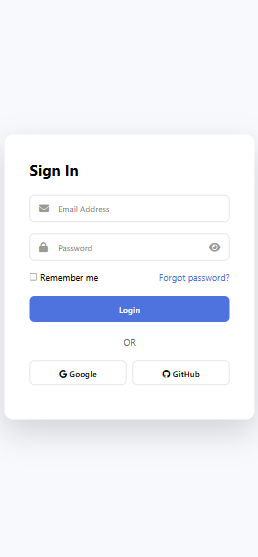
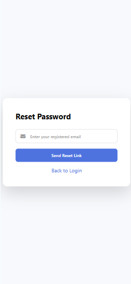

# 🌅 Styled Login UI

> A modern SaaS-style authentication interface built using HTML, CSS, and Vanilla JavaScript.

---

## 📌 Project Overview

This project demonstrates how to build a fully responsive, interactive login interface with clean UI design and structured validation logic.

It focuses on real-world frontend concepts such as:

- UI structuring
- Form validation
- DOM manipulation
- State management
- Responsive design

---

## 🚀 Features

| Feature | Description |
|----------|-------------|
| 🎨 Modern Split Layout | Clean two-panel SaaS-inspired UI |
| 🌇 Sunset Gradient Theme | Visually appealing background |
| 🔐 Password Toggle | Show / hide password functionality |
| 🔁 Forgot Password Flow | Switch to reset screen without reload |
| 🌍 Social Login UI | Google & GitHub buttons (UI simulation) |
| 📱 Responsive Design | Optimized for mobile and desktop |
| 🧠 Client-Side Validation | Email & password validation logic |

---

## 🛠 Tech Stack

| Technology | Purpose |
|------------|----------|
| HTML5 | Semantic structure |
| CSS3 (Flexbox) | Layout & responsiveness |
| Vanilla JavaScript | DOM manipulation & validation |

---

## 📸 Project Screenshots

### 💻 Desktop Login

---

### 🔁 Reset Password (Desktop)

---

### 📱 Mobile Login

---

### 📱 Mobile Reset Password

---

## 🧠 Key Concepts Demonstrated

- Responsive layout using Flexbox
- UI state switching without page reload
- Event handling with JavaScript
- Controlled form submission
- Clean separation of concerns
- Reusable UI structure thinking

---

## 🔐 Validation Implementation

### Login Form

- Email pattern validation
- Minimum password length
- Prevent default form submission
- Dynamic success/error message display

### Reset Password

- Email validation before submission
- UI switching handled via class toggling

---

## 🗂 Project Structure

styled-login-ui/
│
├── index.html
├── style.css
├── script.js
└── output/
├── login-ui-pc.png
├── login-ui-mobile.png
├── login-ui-pc-reset-password.png
└── login-ui-mobile-reset-password.png

---

## 🎤 Interview Talking Points

**How did you implement validation?**  
Using regular expressions and conditional checks inside JavaScript submit event handlers.

**How did you prevent invalid submissions?**  
Used `event.preventDefault()` and validated inputs before allowing success state.

**How is client-side validation different from server-side validation?**  
Client-side validation improves UX and reduces server load, while server-side validation ensures security and data integrity.

---

## 🔮 Future Improvements

- Backend authentication integration
- API-based login handling
- JWT session management
- Toast notifications
- Accessibility improvements

---

## 👨‍💻 Author

**Rajeev Ranjan Singh**  
Frontend Developer

---

⭐ If you found this project helpful, consider giving it a star.
